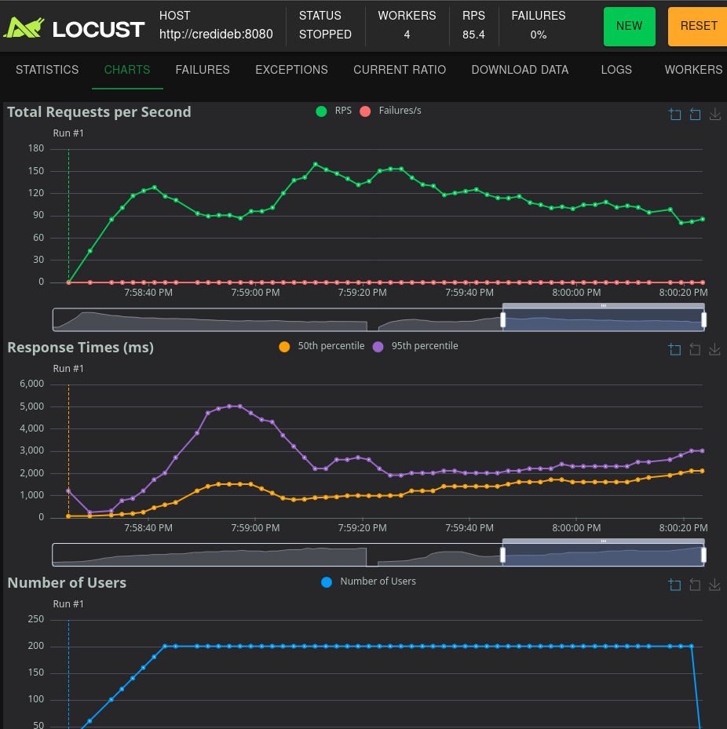
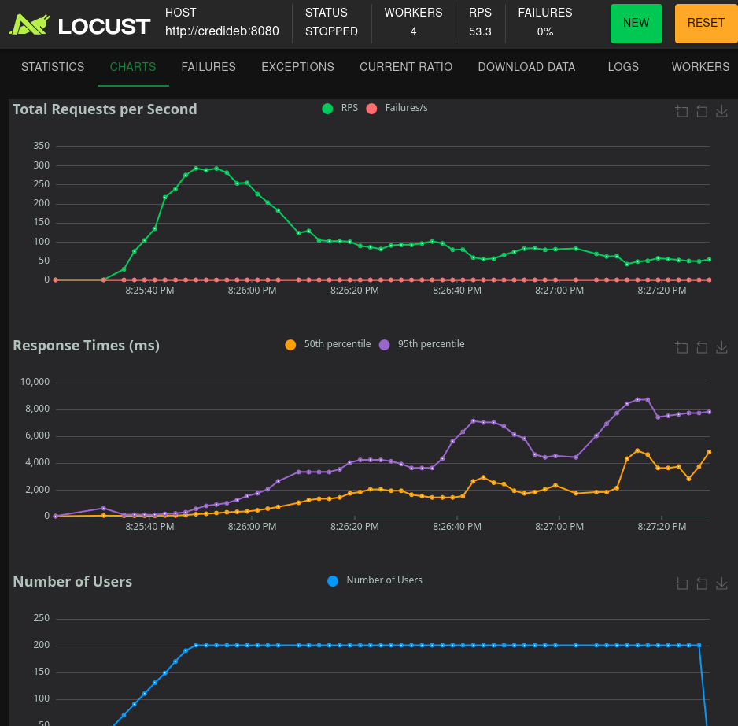
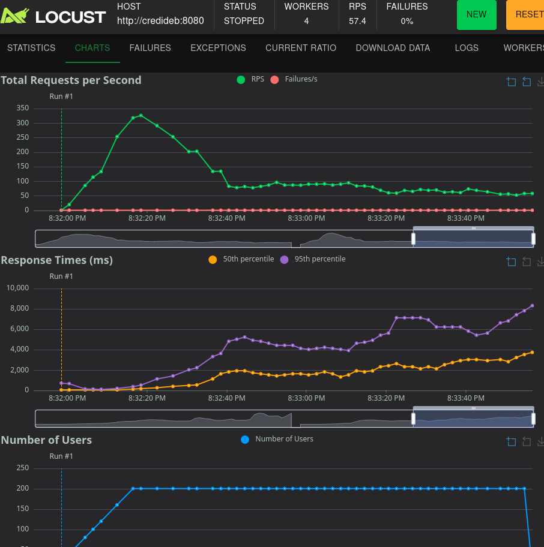

## Testes

### Analises
 - Estranho pq com mais processador no banco a aplicaçao ficou mais lenta, mas nao era isso que queriamos.
 - Este stressTest tem um "bug".
   - Agencia e conta nao podem se repetir, entao ao rodar o teste de stress na API de criaçao de conta, vai ocorrer varios erros de duplicate ley
     - Nao sei se tem como resolver.
     - Vou desligar o teste de stress na API de criaçao de contas.

> Os testes abaixo foram realizados também para a API de criação de contas. Porem sem o uso da unique key mencionada na análise.
   Foi feito isso apenas para saber a desempenho do sistema no geral.
#### mysql_com_leak_detection_200Users_10em10Segundos.png

 - banco Mysql8
 - 2 minutos rodando, terminou com 88 RPS
 - 200 usuarios com warm up de 10 segundos
 - Usando Mysql com cpus: '0.3' e memory: '1.5GB'
 - Propriedade spring.datasource.hikari.leak-detection-threshold com 2 segundos

#### mysql_com_leak_detection_200Users_10em10Segundos.png

 - banco Mysql8
 - 2 minutos rodando, terminou com 85 RPS
 - 200 usuarios com warm up de 10 segundos
 - Usando Mysql com cpus: '0.3' e memory: '1.5GB'
 - Propriedade spring.datasource.hikari.leak-detection-threshold nao configurada

#### mysql1CPU_com_leak_detection_400Users_10em10Segundos.png

 - banco Mysql8
 - 2 minutos rodando, terminou com 53 RPS
 - 200 usuarios com warm up de 10 segundos
 - Usando Mysql com cpus: '1' e memory: '1.5GB'
 - Propriedade spring.datasource.hikari.leak-detection-threshold nao configurada

#### mysql1CPU_sem_leak_detection_400Users_10em10Segundos.png

 - banco Mysql8
 - 2 minutos rodando, terminou com 57 RPS
 - 200 usuarios com warm up de 10 segundos
 - Usando Mysql com cpus: '1' e memory: '1.5GB'
 - Propriedade spring.datasource.hikari.leak-detection-threshold nao configurada  